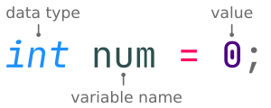

# C++
## Hello World
_example_0.0.cpp_ နာမည်နဲ့ file တစ်ခုဖန်တီးပြီး အောက်ပါ code များထည့်ပါ။
```cpp
// Hello World program.
#include <iostream>

int main()
{

    std::cout << "Hello, World!" << std::endl;

    return 0;
}
```
Terminal မှာ `g++ example_0.0.cpp` လို့ရိုက််ထည်းပြီး compile လုပ်လိုက်ပါ၊ _a.out_ ဆိုတဲ့ file တစ်ခု လက်ရှိ directory အောက်မှာ တိုးလာတာ တွေ့ရပါလိမ့်မယ်။ ထို့နောက် terminal မှာ `./a.out` လို့ရိုက်ပြီး run လိုက်လျှင် __Hello, World!__ ဆိုတဲ့ စာသား ပေါ်လာပါလိမ့်မယ်။

### မှတ်ချက် (comment) များရေးသားခြင်း
eg 0.0 ရဲ့ ပထမစာကြောင်းက comment ပါ။ သူက program ကိုအကျိုးသက်ရောက်မှု မရှိပါဘူး။ 

နောင်တစ်ချိန်မှာ ကိုယ်က သော်၎င်း အခြားသူတစ်ယောက်က သော်၎င်း မိမိရေးခဲ့တဲ့ program ကိုဖတ်ရာမှာ လွယ်ကူလျှင်မြန်စွာ နားလည်ဖို့ အတွက် comment များကို ရေးသားရပါတယ်။

single-line နဲ့ multi-line ဆိုပြီး comment ရေးသားနည်း (၂) နည်းရှိပါတယ်၊ single-line က ယခု ရေးသာထားတဲ့နည်းပါ၊ `//` (double slash) ရဲ့နောက်မှာ ရေးရပြီး မှတ်ချက် (၁) ကြောင်းထက်ပိုရေးလို့ မရပါဘူး။ multi-line က `/*` နဲ့ `*/` ကြားမှာ စာကြောင်းရေများများ ရေးလို့ရပါတယ်။ 

```cpp
/*
    This is an example of multi-line comment 
    which can be write severial comments.
*/
```

### Preprocessing Directive
```cpp 
#include <iostream>
```
iostream ဆိုတဲ့ header file ကို လက်ရှိ program ထဲသို့ တစ်ပါတည်း compile လုပ်စဉ် ရောထည့်ပေးပါလို့ compiler ကိုအမိန့်ပေးလိုက်တာပါ။ header file ဆိုတာကလည်း program file ပါပဲ၊ ဒီလိုရေးသားလိုက်ခြင်းအားဖြင့် header file ထဲက လုပ်ဆောင်ချက်များကို ခေါ်ယူသုံးစွဲလို့ရသွားပါတယ်။ 

C++ ရဲ့ library ထဲက built-in header file တွေကို ခေါ်ယူလိုလျှင် greater than `<` နဲ့ less than signs `>` နှစ်ခုကြားမှာ ထက်ပါအတိုင်း ရေးရပါတယ်။ အခြား thirdparty နဲ့ လက်ရှိ directory ထဲမှာရှိတဲ့ header file တွေကို ခေါ်ယူလိုလျှင်တော့ double quotes `"` နှစ်ကြားမှာ ရေးသားရပါတယ်။ ဥပမာ - `#include "myheader.h"`။

### Main Function

```cpp
int main()
{

    // Statements
    // ...
    // ...

    return 0;
}
```
C++ မှာ ကျွန်ုပ်တို့ရေး မည့် code statement တွေကို main function ရဲ့ code block အစဖြစ်တဲ့ left brace `{` ကနေစပြီး တစ်ကြောင်းခြင်း ဖြေရှင်းသွားမှာဖြစ်ပါတယ်။ right brace `}` ရောက်တဲ့အခါမှာ အကုန် ဖြေရှင်းပြီးဖြစ်သည်။ ထို bracket နှစ်ခုကြားကို code block တစ်ခုလို့ခေါ်ပါတယ်။

`return 0;` ကတော့ main function ကိုခေါ်ထားတဲ့ operating system ကို သုညဆိုတဲ့ တန်ဖိုးကိုပြန်ပေးပြီး program ကို အဆုံးသတ် လိုက်မှာဖြစ်ပါတယ်။

```cpp
std::cout << "Hello, World!" << std::endl;
```
Hello, World! ဆိုတဲ့ စာသားကို ဒီ statement ထုတ်ပေးတာပါ။ 
- std ဆိုတာက cout function ရှိနေတဲ့ class ဖြစ်ပါတယ်။ 
- cout ဆိုတာက program ကို output ထုတ်ပေးမည့် လုပ်ဆောင်ချက် တစ်ခု ဖြစ်ပါတယ်။ သူ့ကို iostream ဆိုတဲ့ header ထဲကခေါ်ယူထားခဲ့တာပါ။ 
- `<<` ကို steam insertion operator လို့ခေါ်ပြီး နောက်က စာသားတွေကို cout သို့ပေးပြီး screen မှာပြသပေးဖို့ဖြစ်ပါတယ်။ 
- endl ကတော့ စာကြောင်း နောက်တစ်ကြာင်း ဆင်းပေးဖို့ပါ၊ `'\n'`နဲ့ တူပြီး သူကတော့ bundle ကို refrash လုပ်ပေးပါသေးတယ်။ သူလည်းပဲ std class ထဲကပါ။
- statement တစ်ကြောင်းဆုံးတိုင်း `;` semicolon ပိတ်ပေးရပါတယ်။ 

> semicolon မေ့ကျန်ရင် error တက်မှာပါ။

## Identifiers
_example_0.1.cpp_
```cpp
// Adding the two numbers.
#include <iostream>

using namespace std;

int main()
{
    int first_num;
    int second_num;
    int total;

    first_num = 2;
    second_num = 3;
    total = first_num + second_num;

    cout << "Total = " << total << endl;
    return 0;
}
```
ဒီ program က ကိန်းပြည့်နှစ်လုံးကို ပေါင်းပေးတာပါ။ program ထဲရှိ first_num၊ second_num နှင့် total ဆိုတာ variable name တွေဖြစ်ပါတယ်။ အချက်အလက် တန်ဖိုးတွေ မှတ်ဉာဏ်မှာ ခဏသိမ်းပေးဖို့အတွက် နာမည်လေးတွေ တပ်ပေးရပါတယ်။ ဒီလိုနာမည်လေးတွေကို identifier လို့ခေါ်ပါတယ်။

နာမည်တွေပေးရာမှာ ကန့်သတ်ချက် အချို့ရှိပါတယ်။ ထိုကန့်သတ်ချက်မှာ အောက်ပါအတိုင်းဖြစ်ပါတယ်။

- နာမည်ပေးရာမှာ a ကနေ z၊ A ကနေ Z၊ 0 ကနေ 9 နှင့် _ (underscore character) စတဲ့ စာလုံးတွေပဲ ပါဝင်လို့ရမှာပါ။ အခြား စာလုံးဆိုရင် space တစ်ချက်တောင် ခြားပေးလို့မရပါဘူး။
- 0-9 ကိန်းဂဏန်းတွေနဲ့ စရေးလို့မရပါဘူး။
- ကြိုက်သလောက် ရှည်ရှည်ရေးလို့ရပေမဲ့ ရှေဆုံးစာလုံး (၃၂) အကျုံးဝင်ပါတယ်။ (၁) လုံးတည်းပေးလည်း ရပါတယ်။
- C++ က case sensitive ဖြစ်လို့ ဥပမာ- MyName, myName နှင့် myname တို့က တစ်ခုနှင့်တစ်ခု မတူပါဘူး။
- C++ သီးသန့် သတ်မှတ်ပေးထားတဲ့ စကားလုံး (keyword) တွေကိုသုံးလို့မရပါဘူး။ ထိုစကားလုံးများမှာ-


| 1 | 2 | 3 | 4 |
| :---: | :---: | :---: | :---: |
| asm | else | new | this |
| auto | enum | operator | throw |
| bool | explicit | private | true |
| break | export | protected | try |
| case | extern | public | typedef |
| catch | false | register | typeid |
| char | float | reinterpret_cast | typename |
| lass | for | return | union |
| const | friend | short | unsigned |
| const_cast | goto | signed | using |
| continue | if | sizeof | virtual |
| default | inline | static | void |
| delete | int | static_cast | volatie |
| do | long | struct | wchar_t |
| double | mutable | switch | while |
| dynamic_cast | namespace | templete |
တို့ဖြစ်ပါတယ်။

> နာမည်တွေပေးရာမှာ variable, class, function, etc,... စတာတွေကို ပေးတာပါ။ ပေးပုံပေးနည်း styles တွေရှိပါတယ်။ ကြိုက်သလိုရေးလို့ရနိုင်ပေမဲ့ ဖတ်ရလွယ်အောင် တစ်ခုကို style တစ်မျိုးနဲ့ပေးသင့်ပါတယ်။ 

## Data Types
