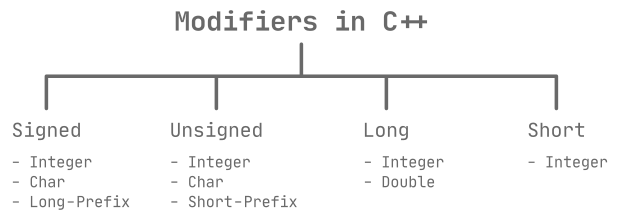

# C++
## Hello World
_example_0.0.cpp_ နာမည်နဲ့ file တစ်ခုဖန်တီးပြီး အောက်ပါ code များထည့်ပါ။
```cpp
// Hello World program.
#include <iostream>

int main()
{

    std::cout << "Hello, World!" << std::endl;

    return 0;
}
```
Terminal မှာ `g++ example_0.0.cpp` လို့ရိုက််ထည်းပြီး compile လုပ်လိုက်ပါ၊ _a.out_ ဆိုတဲ့ file တစ်ခု လက်ရှိ directory အောက်မှာ တိုးလာတာ တွေ့ရပါလိမ့်မယ်။ ထို့နောက် terminal မှာ `./a.out` လို့ရိုက်ပြီး run လိုက်လျှင် __Hello, World!__ ဆိုတဲ့ စာသား ပေါ်လာပါလိမ့်မယ်။

### မှတ်ချက် (comment) များရေးသားခြင်း
eg 0.0 ရဲ့ ပထမစာကြောင်းက comment ပါ။ သူက program ကိုအကျိုးသက်ရောက်မှု မရှိပါဘူး။ 

နောင်တစ်ချိန်မှာ ကိုယ်က သော်၎င်း အခြားသူတစ်ယောက်က သော်၎င်း မိမိရေးခဲ့တဲ့ program ကိုဖတ်ရာမှာ လွယ်ကူလျှင်မြန်စွာ နားလည်ဖို့ အတွက် comment များကို ရေးသားရပါတယ်။

single-line နဲ့ multi-line ဆိုပြီး comment ရေးသားနည်း (၂) နည်းရှိပါတယ်၊ single-line က eg 0.0 မှာ ရေးသာထား တဲ့ပုံစံပါ၊ `//` (double slash) ရဲ့နောက်မှာ ရေးရပြီး မှတ်ချက် (၁) ကြောင်းထက်ပိုရေးလို့ မရပါဘူး။ multi-line က `/*` နဲ့ `*/` ကြားမှာ စာကြောင်းရေများများ ရေးလို့ရပါတယ်။ 

```cpp
/*
    This is an example of multi-line comment 
    which can be write severial comments.
*/
```

### Preprocessing Directive
```cpp 
#include <iostream>
```
iostream ဆိုတဲ့ header file ကို လက်ရှိ program ထဲသို့ တစ်ပါတည်း compile လုပ်စဉ် ရောထည့်ပေးပါလို့ compiler ကိုအမိန့်ပေးလိုက်တာပါ။ header file ဆိုတာကလည်း program file ပါပဲ၊ ဒီလိုရေးသားလိုက်ခြင်းအားဖြင့် header file ထဲက လုပ်ဆောင်ချက်များကို ခေါ်ယူသုံးစွဲလို့ရသွားပါတယ်။ 

C++ ရဲ့ library ထဲက built-in header file တွေကို ခေါ်ယူလိုလျှင် greater than `<` နဲ့ less than signs `>` နှစ်ခုကြားမှာ ထက်ပါအတိုင်း ရေးရပါတယ်။ အခြား thirdparty နဲ့ လက်ရှိ directory ထဲမှာရှိတဲ့ header file တွေကို ခေါ်ယူလိုလျှင်တော့ double quotes `"` နှစ်ကြားမှာ ရေးသားရပါတယ်။ ဥပမာ - `#include "myheader.h"`။

### Main Function

```cpp
int main()
{

    // Statements
    // ...
    // ...

    return 0;
}
```
C++ မှာ ကျွန်ုပ်တို့ရေး မည့် code statement တွေကို main function ရဲ့ code block အစဖြစ်တဲ့ left brace `{` ကနေစပြီး တစ်ကြောင်းခြင်း ဖြေရှင်းသွားမှာဖြစ်ပါတယ်။ right brace `}` ရောက်တဲ့အခါမှာ အကုန် ဖြေရှင်းပြီးဖြစ်သည်။ ထို bracket နှစ်ခုကြားကို code block တစ်ခုလို့ခေါ်ပါတယ်။

`return 0;` ကတော့ main function ကိုခေါ်ထားတဲ့ operating system ကို သုညဆိုတဲ့ တန်ဖိုးကိုပြန်ပေးပြီး program ကို အဆုံးသတ် လိုက်မှာဖြစ်ပါတယ်။

```cpp
std::cout << "Hello, World!" << std::endl;
```
Hello, World! ဆိုတဲ့ စာသားကို ဒီ statement ထုတ်ပေးတာပါ။ 
- `std` ဆိုတာက cout function ရှိနေတဲ့ class ဖြစ်ပါတယ်။ 
- `cout` ဆိုတာက program ကို output ထုတ်ပေးမည့် လုပ်ဆောင်ချက် တစ်ခု ဖြစ်ပါတယ်။ သူ့ကို iostream ဆိုတဲ့ header ထဲကခေါ်ယူထားခဲ့တာပါ။ 
- `<<` ကို steam insertion operator လို့ခေါ်ပြီး နောက်က စာသားတွေကို cout သို့ပေးပြီး screen မှာပြသပေးဖို့ဖြစ်ပါတယ်။ 
- `endl` ကတော့ စာကြောင်း နောက်တစ်ကြာင်း ဆင်းပေးဖို့ပါ၊ `'\n'`နဲ့ တူပြီး သူကတော့ bundle ကို refrash လုပ်ပေးပါသေးတယ်။ သူလည်းပဲ std class ထဲကပါ။
- statement တစ်ကြောင်းဆုံးတိုင်း `;` semicolon ပိတ်ပေးရပါတယ်။ 

> semicolon မေ့ကျန်ရင် error တက်မှာပါ။

## Identifiers
_example_0.1.cpp_
```cpp
// Adding the two numbers.
#include <iostream>

using namespace std;

int main()
{
    int first_num;
    int second_num;
    int total;

    first_num = 2;
    second_num = 3;
    total = first_num + second_num;

    cout << "Total = " << total << endl;
    return 0;
}
```
ဒီ program က ကိန်းပြည့်နှစ်လုံးကို ပေါင်းပေးတာပါ။ program ထဲရှိ `first_num`၊ `second_num` နှင့် `total` ဆိုတာ variable name တွေဖြစ်ပါတယ်။ အချက်အလက် တန်ဖိုးတွေ မှတ်ဉာဏ်မှာ ခဏသိမ်းပေးဖို့အတွက် နာမည်လေးတွေ တပ်ပေးရပါတယ်။ ဒီလိုနာမည်လေးတွေကို identifier လို့ခေါ်ပါတယ်။

နာမည်တွေပေးရာမှာ ကန့်သတ်ချက် အချို့ရှိပါတယ်။ ထိုကန့်သတ်ချက်မှာ အောက်ပါအတိုင်းဖြစ်ပါတယ်။

- နာမည်ပေးရာမှာ `a` ကနေ `z`၊ `A` ကနေ `Z`၊ `0` ကနေ `9` နှင့် _ (underscore character) စတဲ့ စာလုံးတွေပဲ ပါဝင်လို့ရမှာပါ။ အခြား စာလုံးဆိုရင် space တစ်ချက်တောင် ခြားပေးလို့မရပါဘူး။
- 0-9 ကိန်းဂဏန်းတွေနဲ့ စရေးလို့မရပါဘူး။
- ကြိုက်သလောက် ရှည်ရှည်ရေးလို့ရပေမဲ့ ရှေဆုံးစာလုံး (၃၂) အကျုံးဝင်ပါတယ်။ (၁) လုံးတည်းပေးလည်း ရပါတယ်။
- C++ က case sensitive ဖြစ်လို့ ဥပမာ- MyName, myName နှင့် myname တို့က တစ်ခုနှင့်တစ်ခု မတူပါဘူး။
- C++ အတွက်သီးသန့် သတ်မှတ်ပေးထားတဲ့ စကားလုံး (keyword) တွေကိုသုံးလို့မရပါဘူး။ ထိုစကားလုံးများမှာ-


|   |   |   |   |
| :---: | :---: | :---: | :---: |
| asm | else | new | this |
| auto | enum | operator | throw |
| bool | explicit | private | true |
| break | export | protected | try |
| case | extern | public | typedef |
| catch | false | register | typeid |
| char | float | reinterpret_cast | typename |
| lass | for | return | union |
| const | friend | short | unsigned |
| const_cast | goto | signed | using |
| continue | if | sizeof | virtual |
| default | inline | static | void |
| delete | int | static_cast | volatie |
| do | long | struct | wchar_t |
| double | mutable | switch | while |
| dynamic_cast | namespace | templete |


တို့ဖြစ်ပါတယ်။

> နာမည်တွေပေးရာမှာ variable, class, function, etc,... စတာတွေကို ပေးတာပါ။ ပေးပုံပေးနည်း styles တွေရှိပါတယ်။ ကြိုက်သလိုရေးလို့ရနိုင်ပေမဲ့ ဖတ်ရလွယ်အောင် တစ်ခုကို style တစ်မျိုးနဲ့ပေးသင့်ပါတယ်။ 

## Data Types


data types ဆိုတာ မှတ်ဉာဏ်မှာ အချက်အလက်တွေရဲ့ တန်ဖိုးတွေကို သိုမှီးဖို့အတွက် နေရာယူမည့်မှတ်ဉာဏ် ပမာဏကို ကြိုတင်သတ်မှတ် ပေးတာပါ။ Data types တစ်ခုနှင့်တစ်ခုက မှတ်ဉာဏ်မှာ နေရာယူပုံခြင်း မတူကြပါဘူး။ Primary, Derived, User Defined ဆိုပြီး data-types ကို (၃) မျိူးခွဲနိုင်ပါတယ်။


### Primitive Datatypes
primitive data-types ဆိုတာ built-in data-types တွေဖြစ်ပါတယ်။ သူတို့ကို define လုပ်ပြီး တန်းသုံးနိုင်ပါတယ်။ primitive data-types ထဲမှာ-

- Integer
- Character
- Boolean
- Floating Point
- Double Floating Point
- Valueless or Void
- Wide Character

တို့ပါဝင်ပါတယ်။

### Derived Data Types

ဒီ data-types ကတော့ primitive data-types ကနေ ဆင်းသက်လာတာပါ။ သူ့မှာ-

- Function
- Array
- Pointer
- Reference

ဆိုပြီး (၄) မျိုးရှိပါတယ်။

### Abstract or User-Defined Data Types

သူကတော့ user ကိုယ်တိုင်သတ်မှတ်ပေးရတဲ့ data-types အမျိုးအစားတွေပါ။ သူမှာ-

- Class
- Structure
- Union
- Enumeration
- Typedef defined DataType

တွေပါဝင်ပါတယ်။

__Integer__: ကိန်းပြည့်တွေ သိုလှောင်ပေးဖို့ သုံးပါတယ်။ ဒဿမကိန်းတွေ လက်မခံနိုင်ပါဘူး။ `int` ဆိုတဲ့ keyword ဖြင့်အသုံး ပြုရပါတယ်။ မှတ်ဉာဏ်ပမာဏ 4 bytes အသုံးပြုပါတယ်။ -2147483648 ကနေ 2147483647 အထိတန်ဖိုးတွေကို သိုလှောင်ပေးနိုင်ပါတယ်။


__Character__: [ASCII Characters](https://www.ascii-code.com/) တွေရဲ့တန်ဖိုးကိုတွေ သိုလှောင်ပေးထားဖို့သုံးတာပါ။ `char` ဆိုတဲ့ keyword ကိုအသုံးပြုရပါတယ်။ သူကတော့ ယေဘုံယျအားဖြင့် မှတ်ဉာဏ်ပမာဏ 1 byte ကို အသုံးပြုပါတယ်။  သူ့ရဲ့  ranges ကတော့ -128 ကနေ 127 (သို့မဟုတ်) 0 ကနေ 255 အထိရှိပါတယ်။ 

```cpp
// Using char variable.
#include <iostream>

using namespace std;

int main()
{
	char ch = 'A';
	cout << "ch = " << ch << endl;
	cout << "ch = " << (int)ch << ", hence an integer.";

	return 0;
}
```

__Boolean__: သူက `true` နဲ့ `false` ဆိုတဲ့ တန်ဖိုးနှစ်မျိုးပဲ သိုလှောင်ပေးနိုင်ပါတယ်။ `0` သည်လည်း `false` ဖြစ်ပြီး `0` မဟုတ်သောကိန်းမှန်သမျှသည် `true` ဖြစ်သည်။ boolean အတွက် keyword က `bool` ဖြစ်ပါတယ်။ 

သီအိုရီအရ boolean က 1 bit ဖြစ်တယ်၊ သို့သော်လည်း တစ်ကယ်တမ်း 1 byte ကနေတစ်ဆင့် ပြန်ခွဲယူရမှာမို့ အချိန်ကြာမှာ ဖြစ်တဲ့အတွက် compiler ကိုင်တွယ်ရလွယ်တဲ့ 1 byte ကိုပဲသုံးလိုက်တာပါ။  

```cpp
// Using Boolean variable.
#include <iostream>

using namespace std;

int main()
{
	bool x = false; // equal 0
	
	if(x)
	{
		cout << "x is true"; // none 0
	}
	else
	{
		cout << "x is false";
	}

	cout << endl;

	return 0;
}
```

__Floaing Point__: ဒဿမကိန်းတွေ သိုလှောင်ပေးဖို့သုံးတာပါ။ `float` ဆိုတဲ့ keyword ဖြင်အသုံးပြုရပါတယ်။ ယေဘုံယျအားဖြင့် မှတ်ဉာဏ် 4 bytes ပမာဏကို အသုံးပြုပါတယ်။ ပုံမှန်အားဖြင့် decimal point (၇) နေရာလောက်ယူလိုရပါတယ်။

__Double Floating Point__: `float` နဲ့ အတူတူပါပဲ ဒဿမကိန်းတွေသိုမှီးဖို့ပါ။ `double` ဆိုတဲ့ keyword ကိုအသုံးပြုရပါတယ်။ မှတ်ဉာဏ် 4 bytes အသုံးပြုလို့ `float` ထက် range (၂)ဆ ရှိပါတယ်။ ပုံမှန်အားဖြင့် decimal point (၁၅) နေရာလောက်ယူလိုရပါတယ်။

```cpp
// creating float type variables
float num1 = 3.0f;
float num2 = 3.5f;
float num3 = 3E-5f; // 3x10^-5

// creating double type variables
double num4 = 3.0;
double num5 = 3.5;
double num6 = 3E-5; // 3x10^-5
```

`0.3f` မှာ `f` (or) `F` ဆိုတာ `float` ဖြစ်ကြောင်း compiler ကို ပြောပေးတာပါ။ `0.3` ပဲဆိုရင် `double` လို့ပဲ compiler ကသတ်မှတ်ပါလိမ့်မယ်။ ထိုကြောင့် float type ဆိုရင် data-type ကြေငြာထားသော်လည်း `f` (or) `F` ကို မဖြစ််မနေထည့်ပေးရပါမယ််။

`3E-5` မှာ `e` (or) `E` ဆိုတာ က exponetial ဖြစ်ပါတယ်၊ 3 x 10<sup>-5</sup> ဆိုတဲ့သဘောပါ။ 

> အရမ်းတိကြဖို့ မလိုဘူးဆိုရင် double အစား float ကိုပဲ အမြဲသုံးသင့်ပါတယ်။

__Void__: သူ့ရဲ့အဓိပ္ပာယ်အတိုင်း ဘာတန်ဖိုးမှ မရှိပါဘူး။ တန်းဖိုးမဲ့တဲ့ entity ကို ကိုယ်စားပြုပါတယ်။ void data type ကို return ပြန်ပေးစရာမလိုတဲ့ function တွေမှာ အသုံးပြုတာပါ။

__Wide Character__: သူကလည်းပဲ character data type အမျိုးအစားပါ။ ဒါပေမဲ့ size က ပုံမှန် 8-bit datatype ထက်ကြီးပါတယ်။ `wchar_t` ဆိုတဲ့ keyword နဲ့ကိုယ်စားပြုပါတယ်။ ယေဘုံယျအားဖြင့်မှတ်ဉာဏ် ပမာဏ 2 bytes သို့မဟုတ် 4 bytes နေရာယူပါတယ်။ `char` က 0 ကနေ 255 ပဲဝင်ဆန့်လို့ English နဲ့ Latin လောက်ပဲထောက်ပံ့နိုင်ပါတယ်၊ နိုင်ငံခြားဘာသာတွေကိုကိုင်တွယ်ဖို့ `wchar_t` ကိုအသုံးပြုရပါတယ်။

## Data Type Modifiers
Data type modifier တွေကို built-in data types တွေရဲ့ ပုံမှန်ကိုင်တွယ်နိုင်တဲ့ data တွေရဲ့ length တွေကို ပြုပြင်ဖို့ သုံးပါတယ်။

